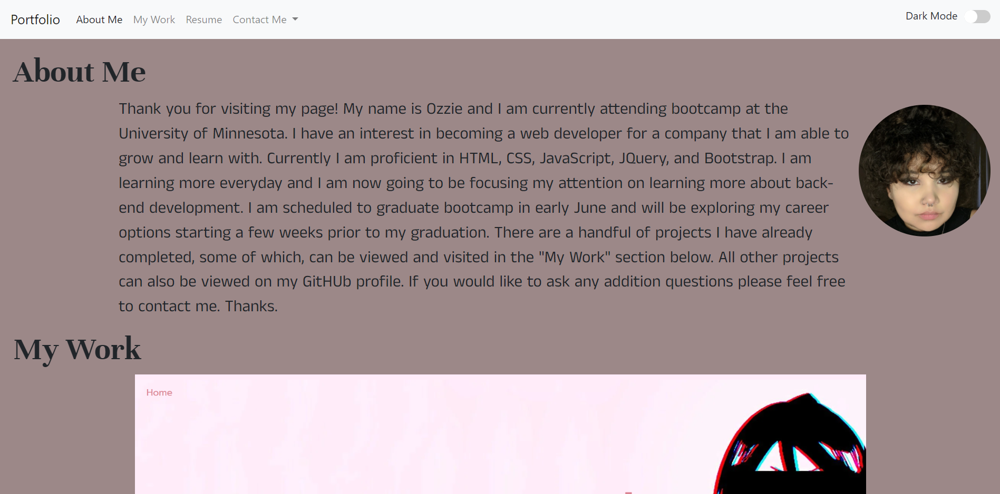
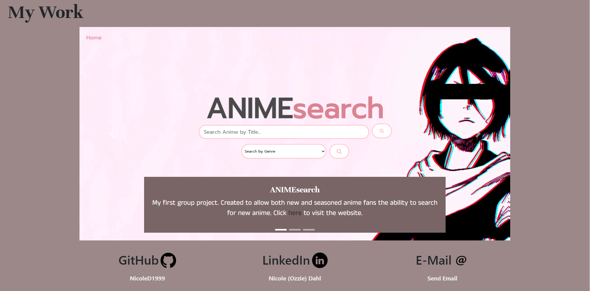

# Portfolio
In this application the user will be able to view and interact with my portfolio in mutliple ways. The user can visit completed projects by clicking on the "here" text in each carousel image. User can also navigate to certain parts of the page by clicking the corresponding title in the nav bar. In the "Contact Me" section of nav bar user will be redirected to corresponding page by clicking on text. If used clicks resume user will be redirected to a downloadable resume. Contact info on the bottom of the page is also interactable, if user clicks corresponding username the user will be redirected to that page.

Technology Used -

    ‣ Bootstrap CSS

    ‣ Google Fonts

    ‣ JQuery

Click [here](https://nicoled1999.github.io/first_portfolio/) to view my website.

